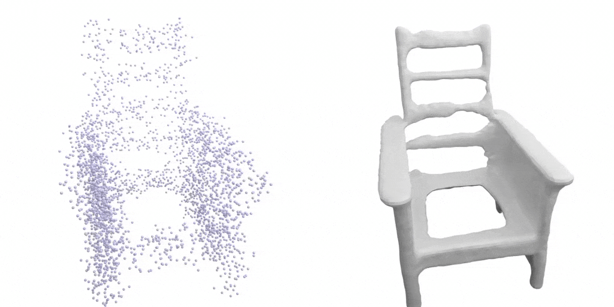
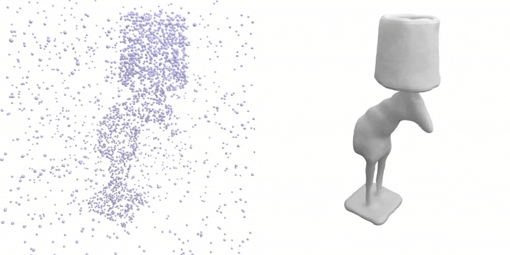

# Shape As Points (SAP)

### [**Paper**](https://arxiv.org/abs/2106.03452) | [**Project Page**](https://pengsongyou.github.io/sap) | [**Short Video (6 min)**](https://youtu.be/FL8LMk_qWb4) | [**Long Video (12 min)**](https://youtu.be/TgR0NvYty0A)  <br>


This repository contains the implementation of the paper:

Shape As Points: A Differentiable Poisson Solver  
[Songyou Peng](https://pengsongyou.github.io/), [Chiyu "Max" Jiang](https://www.maxjiang.ml/), [Yiyi Liao](https://yiyiliao.github.io/), [Michael Niemeyer](https://m-niemeyer.github.io/), [Marc Pollefeys](https://www.inf.ethz.ch/personal/pomarc/) and [Andreas Geiger](http://www.cvlibs.net/)  
**NeurIPS 2021 (Oral)**  


If you find our code or paper useful, please consider citing
```bibtex
@inproceedings{Peng2021SAP,
 author    = {Peng, Songyou and Jiang, Chiyu "Max" and Liao, Yiyi and Niemeyer, Michael and Pollefeys, Marc and Geiger, Andreas},
 title     = {Shape As Points: A Differentiable Poisson Solver},
 booktitle = {Advances in Neural Information Processing Systems (NeurIPS)},
 year      = {2021}}
```


## Installation
First you have to make sure that you have all dependencies in place.
The simplest way to do so, is to use [anaconda](https://www.anaconda.com/). 

You can create an anaconda environment called `sap` using
```
conda env create -f environment.yaml
conda activate sap
```

Next, you should install [PyTorch3D](https://pytorch3d.org/) (**>=0.5**) yourself from the [official instruction](https://github.com/facebookresearch/pytorch3d/blob/master/INSTALL.md#3-install-wheels-for-linux).  

And install [PyTorch Scatter](https://github.com/rusty1s/pytorch_scatter):
```sh
conda install pytorch-scatter -c pyg
```


## Demo - Quick Start

First, run the script to get the demo data:

```bash
bash scripts/download_demo_data.sh
```

### Optimization-based 3D Surface Reconstruction

You can now quickly test our code on the data shown in the teaser. To this end, simply run:

```python
python optim_hierarchy.py configs/optim_based/teaser.yaml
```
This script should create a folder `out/demo_optim` where the output meshes and the optimized oriented point clouds under different grid resolution are stored.

To visualize the optimization process on the fly, you can set `o3d_show: Frue` in [`configs/optim_based/teaser.yaml`](https://github.com/autonomousvision/shape_as_points/tree/main/configs/optim_based/teaser.yaml).

### Learning-based 3D Surface Reconstruction
You can also test SAP on another application where we can reconstruct from unoriented point clouds with either **large noises** or **outliers** with a learned network.



For the point clouds with large noise as shown above, you can run:
```python
python generate.py configs/learning_based/demo_large_noise.yaml
```
The results can been found at `out/demo_shapenet_large_noise/generation/vis`.


As for the point clouds with outliers, you can run:
```python
python generate.py configs/learning_based/demo_outlier.yaml
```
You can find the reconstrution on `out/demo_shapenet_outlier/generation/vis`.


## Dataset

We have different dataset for our optimization-based and learning-based settings.

### Dataset for Optimization-based Reconstruction
Here we consider the following dataset: 
- [Thingi10K](https://arxiv.org/abs/1605.04797) (synthetic)
- [Surface Reconstruction Benchmark (SRB)](https://github.com/fwilliams/deep-geometric-prior) (real scans)
- [MPI Dynamic FAUST](https://dfaust.is.tue.mpg.de/) (real scans)

Please cite the corresponding papers if you use the data.

You can download the processed dataset (~200 MB) by running:
```bash
bash scripts/download_optim_data.sh
```

### Dataset for Learning-based Reconstruction  
We train and evaluate on [ShapeNet](https://shapenet.org/).
You can download the processed dataset (~220 GB) by running:
```bash
bash scripts/download_shapenet.sh
``` 
After, you should have the dataset in `data/shapenet_psr` folder.

Alternatively, you can also preprocess the dataset yourself. To this end, you can: 
* first download the preprocessed dataset (73.4 GB) by running [the script](https://github.com/autonomousvision/occupancy_networks#preprocessed-data) from Occupancy Networks.
* check [`scripts/process_shapenet.py`](https://github.com/autonomousvision/shape_as_points/tree/main/scripts/process_shapenet.py), modify the base path and run the code


## Usage for Optimization-based 3D Reconstruction  

For our optimization-based setting, you can consider running with a coarse-to-fine strategy:
```python
python optim_hierarchy.py configs/optim_based/CONFIG.yaml
```
We start from a grid resolution of 32^3, and increase to 64^3, 128^3 and finally 256^3.

Alternatively, you can also run on a single resolution with:

```python
python optim.py configs/optim_based/CONFIG.yaml
```
You might need to modify the `CONFIG.yaml` accordingly.

## Usage for Learning-based 3D Reconstruction

### Mesh Generation 
To generate meshes using a trained model, use
```python
python generate.py configs/learning_based/CONFIG.yaml
```
where you replace `CONFIG.yaml` with the correct config file.

#### Use a pre-trained model
The easiest way is to use a pre-trained model. You can do this by using one of the config files with postfix `_pretrained`.

For example, for 3D reconstruction from point clouds with outliers using our model with 7x offsets, you can simply run:
```python
python generate.py configs/learning_based/outlier/ours_7x_pretrained.yaml
```

The script will automatically download the pretrained model and run the generation. You can find the outputs in the `out/.../generation_pretrained` folders.

**Note** config files are only for generation, not for training new models: when these configs are used for training, the model will be trained from scratch, but during inference our code will still use the pretrained model.

We provide the following pretrained models:
```
noise_small/ours.pt
noise_large/ours.pt
outlier/ours_1x.pt
outlier/ours_3x.pt
outlier/ours_5x.pt
outlier/ours_7x.pt
outlier/ours_3plane.pt
```


### Evaluation
To evaluate a trained model, we provide the script [`eval_meshes.py`](https://github.com/autonomousvision/shape_as_points/blob/main/eval_meshes.py). You can run it using:
```python
python eval_meshes.py configs/learning_based/CONFIG.yaml
```
The script takes the meshes generated in the previous step and evaluates them using a standardized protocol. The output will be written to `.pkl` and `.csv` files in the corresponding generation folder that can be processed using [pandas](https://pandas.pydata.org/).

### Training

Finally, to train a new network from scratch, simply run:
```python
python train.py configs/learning_based/CONFIG.yaml
```
For available training options, please take a look at `configs/default.yaml`.

